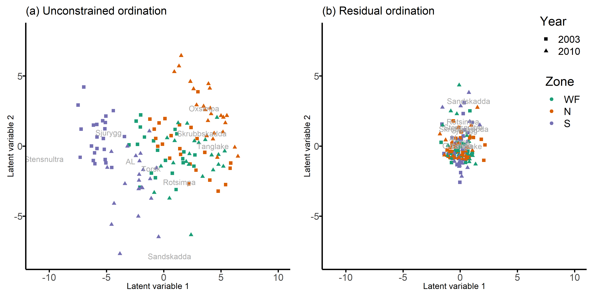
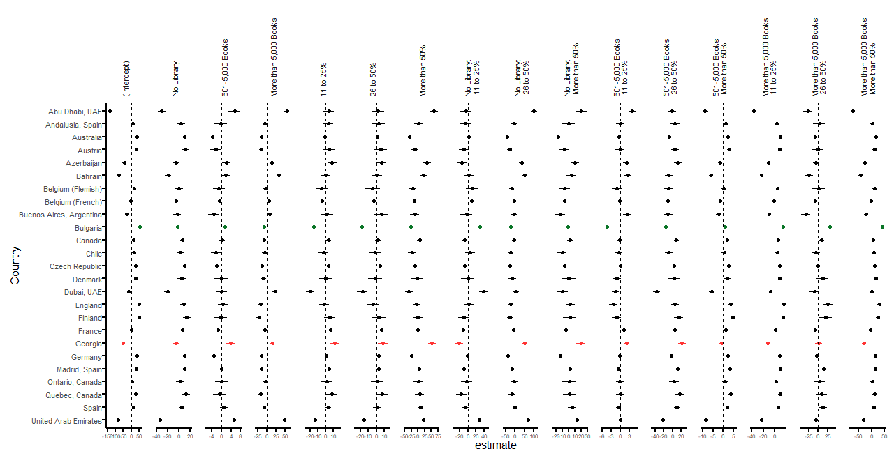
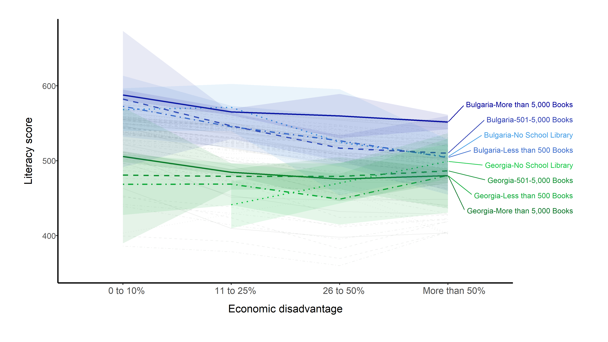

---
output:
  ioslides_presentation:
    incremental: true
    code_folding: show
---


```{css, echo=FALSE}
pre {
  max-height: 400px;
  overflow-y: auto;
}

pre[class] {
  max-height: 400px;
}
```


```{css, echo=FALSE}
.scroll-400 {
  max-height: 300px;
  overflow-y: auto;
  background-color: inherit;
}
```


```{r, include=FALSE, results='hide'}
options(width = 60)
local({
  hook_output <- knitr::knit_hooks$get('output')
  knitr::knit_hooks$set(output = function(x, options) {
    if (!is.null(options$max.height)) options$attr.output <- c(
      options$attr.output,
      sprintf('style="max-height: %s;"', options$max.height)
    )
    hook_output(x, options)
  })
})
```

```{r setup, include=FALSE}
knitr::opts_chunk$set(echo = T)
```

## glmmTMB

- Generalized linear mixed models (GLMMs) can be useful for non-normal data with random effects
- $\texttt{glmmTMB}$ has a familiar interface based off $\texttt{lme4}$ 
- $\texttt{glmmTMB}$ is a fast, flexible and stable package [@brooks2017glmmtmb]
- It has more distributions [available](https://rdrr.io/cran/glmmTMB/man/nbinom2.html)
- Plus flexible zero-inflated models and hurdle models

## House work

First, let's load some packages 
```{r, message=F}
packages <- c("ggplot2", "dplyr", "tidyr", "glmmTMB", "ecostats", "DHARMa")
install.packages(setdiff(packages, rownames(installed.packages()))) 
invisible(lapply(packages, library, character.only = TRUE))

source("functions.R")
```

## Wind Farm Example

- A study in Sweden investigated the effects of an offshore windfarm on the abundance and distribution patterns of benthic fish communities

<div class="centered">
{width=80%}
</div>
 

## Wind Farm Example

The wind farm data is in the ecostats package.

```{r}
wf <- cbind(windFarms$abund, windFarms$X) %>% 
  mutate(ID = 1:nrow(.)) %>% 
  pivot_longer(cols = colnames(windFarms$abund), 
               names_to = "Species",
               values_to = "Abundance")
```

## Wind Farm Example: Study design

```{r}
head(wf)
```

If you want more information you can find it in the help file:
```{r, eval = F}
?windFarms
```

## Wind Farm Example: Data

- Keep stations that were observed in both years
- Remove species that were observed less than 5 times

```{r}
stat03 <- unique(wf[wf$Year=="2003",]$Station)
stat10 <- unique(wf[wf$Year=="2010",]$Station)
sum_abund <- wf %>%
  filter(Station %in% stat03 ) %>%
  group_by(Species) %>%
  summarise(obs = sum(Abundance > 0) ) %>% 
  ungroup() %>% 
  arrange(-obs) # order from most to least abundant

spp_names <- unique(sum_abund$Species[sum_abund$obs>=5])
wf_data <- wf %>% 
  filter(Species %in% spp_names) %>% 
  mutate(Species = factor(Species, levels = spp_names))
```

## Wind Farm Example: Data
```{r class.source = 'fold-hide'}
## Boxplot of abundance of species by year and zone
labs=c(0,1,10,100)
wf_boxplot <- wf_data %>% 
  ggplot(aes(x = Year, y = log(Abundance + 1), fill = Zone)) +
  geom_boxplot(outlier.shape = 21)+
  facet_wrap(~ Species, ncol = 3, scales = "free") +
  labs(x = "Year", color  = "Zone", y = "Abundance [log(y+1)-scale]") +
  scale_y_continuous( breaks = log(labs + 1), labels = labs)+
  theme_classic() +
  theme(legend.position="bottom"  ) +
  scale_fill_brewer(palette = "Set2")
```

## Wind Farm Example: Data

```{r}
wf_boxplot
```

## Wind Farm Example: Why GLMM?


 {width=100%}


## Generalised Linear Mixed Model
<font size="4"> 
A generalised linear mixed model (GLMM) has the following form:

<!-- $$ g(\boldsymbol{\mu_i}) = \boldsymbol{ X_i \beta} + \boldsymbol{Zb_i}   $$ -->
$$ g(\boldsymbol{\mu}) = \boldsymbol{ X \beta} + \boldsymbol{Zb}   $$
where

* g(.) is a known link function
* $\boldsymbol{X}$ is a $n \times p$ model matrix
* $\boldsymbol{\beta}$ is a $p$-dimensional vector of regression coefficients related to the covariates
* $\boldsymbol{Z}$ is a $n \times q$ model matrix for the $q$-dimensional random effects
* $\boldsymbol{b}$ are multivariate random effects,  $\boldsymbol{b} \sim N(\boldsymbol{0}, \boldsymbol{\Sigma} )$
* $\boldsymbol{y} | \boldsymbol{b} \sim  F(\mu, \phi )$, where F is a member of the exponential family, mean $\boldsymbol{\mu}$, nuisance $\boldsymbol{\phi}$

</font size> 

## Generalised Linear Mixed Model
<font size="4"> 
Consider the joint model of the mean abundance, $\mu_{ijk}$, observed at $i = 1, \ldots, n$ observation, $k = 1,\ldots, l$ stations, for $j = 1, \ldots, p$ species as follows:

$$
g(\mu_{ijk}) = \boldsymbol{x_i'\beta} +  \boldsymbol{x_i'b_{j}^{[x]}}  + {b_{k}^{[s]}} + b_{ij}
$$

* $\boldsymbol{x_i}$ are vectors of covariates relating to intercept, zone, year and the interaction of zone and year
* $\boldsymbol{\beta}$ are vectors of fixed coefficients
* $\boldsymbol{b_{j}^{[x]}} \sim N(\boldsymbol{0}, \boldsymbol{\sigma_x^2I})$
* ${b_{k}^{[s]}}  \sim N(0, \sigma^2_s)$
* $\boldsymbol{b_{i}}  \sim N(\boldsymbol{0}, \Sigma_{sp})$ 

</font>

## GLMM: wind farm 

We assume no prior structure about the correlation across species, i.e., unstructured covariance matrix.

```{r}
fit.us <- glmmTMB(Abundance ~ Year*Zone + diag(Year*Zone|Species) + 
                 (1 | Station) +
                 (Species + 0|ID),
               wf_data, family = poisson)
```

## GLMM: reduced-rank random effects

A reduced-rank approach to fit a multivariate random effect 

$$b_{ij} = \boldsymbol{\lambda}_j \boldsymbol{u}_{i}$$

where 

- $\boldsymbol{u_i}$ is a vector of $d$ latent variables
- $\boldsymbol{u_i} \sim N(\boldsymbol{0}, \boldsymbol{I})$ 
- $\boldsymbol{\Lambda} =  \left\{\boldsymbol{\lambda}_1^\top, \ldots, \boldsymbol{\lambda}_p\right\}^\top$ are a matrix of factor loadings

This implies $\boldsymbol{b_i} \sim N(\boldsymbol{0}, \boldsymbol{\Lambda}\boldsymbol{\Lambda'})$

## GLMM: reduced-rank model

```{r echo = T}
wf.glmm <- glmmTMB(Abundance ~ Zone*Year + diag(Zone*Year|Species) +
                     (1|Station) + 
                     ### <b>  
                     rr(Species + 0|ID, 2), 
                   ### </b>
                   family = "poisson", data = wf_data,
                   control = glmmTMBControl(start_method = list(method = "res")))
```

- The number after the comma in the rr formula specifies the rank of the variance-covariance matrix of the multivariate random effects.

- The start_method argument in glmmTMBControl() controls the algorithm used for initialising the rr parameters ($\boldsymbol{\lambda}_j$ and $\boldsymbol{u}_{i}$)

## GLMM: summary

```{r, echo = T, class.output="scroll-400"}
summary(wf.glmm)
```

## GLMM: ordination plot

We can visualise the correlations between species from the estimated latent variables and factor loadings from a model without predictors, i.e., an unconstrained ordination plot

```{r}
wf.glmm.unc <- glmmTMB(Abundance ~  Species + rr(Species + 0 | ID, d = 2),
                       family = "poisson", data = wf_data, 
                       control = glmmTMBControl(start_method = list(method = "res")  ))
```

To get the factor laodings and latent variables for the reduced-rank random effect:
```{r}
wf.unc.fl.b <- extract.rr.par(wf.glmm.unc)
unc.wf.b <- as.data.frame(wf.unc.fl.b$b)
unc.wf.b$ID <- rownames(unc.wf.b)
unc.wf.fl <-  as.data.frame(wf.unc.fl.b$fl)
```


## GLMM: ordination plot

```{r}
cnms <- wf.glmm.unc$modelInfo$reTrms[["cond"]]$cnms
labels <- gsub("Species", "", cnms$ID)
names(unc.wf.b)[1:ncol(unc.wf.fl)] <- paste0("LV", 1:ncol(unc.wf.fl))

zone_col <- wf_data %>%
  select(ID, Zone, Year) %>%
  distinct() %>%
  mutate(ID = as.character(ID))

unc.wf.b <- left_join(unc.wf.b, zone_col, by = "ID")

ordi.plot <- ggplot(unc.wf.b) +
  geom_point(aes(x = LV1, y = LV2, color = Zone, shape = Year) , size = 2) +
  geom_text(data = unc.wf.fl, aes(x = V1, y = V2, label = labels),  colour="dark grey") +
  theme_classic() +
  labs(x = "Latent variable 1", y = "Latent variable 2")+
  scale_color_brewer(palette = "Dark2")

```


## GLMM: ordination plot

```{r}
ordi.plot
```

## GLMM: ordination plot

We can compare the unconstrained ordination plot to a residual ordination plot, i.e., after including zone, year, their interaction and station in the model.  

<div class="centered">
 {width=80%}
</div>

## Random slopes model

<div class="centered">
 {width=80%}
</div>

## Random slopes model example: PIRLS

- Fit a random slopes model with heaps of slopes

- Literacy of students across the world (PIRLS)

- We are interested in the effect of the interaction between economic disadvantage and the size of the school library. 

- Allow the interaction to vary by country

## Global literacy - PIRLS 

<font size="4">

Consider the model of overall literacy score, $y_{ijk}$, for student $i = 1, \ldots, n$, in school $j = 1,\ldots, l$ and country $k = 1, \ldots, p$ as follows:

$$
y_{ijk} = \boldsymbol{x_j'\beta} +  {b_{j}^{[s]}}  + \boldsymbol{x_j'b_{jk}^{[rr]}}  + \epsilon_{ijk}
$$

* $\boldsymbol{x_j}$ are vectors of covariates relating to school factors
* $\boldsymbol{\beta}$ are vectors of fixed coefficients
* ${b_{j}^{[s]}}  \sim N(0, \sigma^2_s)$
* $\boldsymbol{b_{j}^{[rr]}}  \sim N(\boldsymbol{0}, \boldsymbol{\Lambda \Lambda'})$  where $\boldsymbol{\Lambda}$ is the full matrix of factor loadings.
* $\epsilon_{ijk} \sim N(0, \sigma^2)$ 

</font>

## PIRLS: reduced-rank model

This may take a little longer to fit 

```{r, eval = F}
load("data/pirls_data.RData")

fit.rr <- glmmTMB(Overall ~  Size_lib*Eco_disad +
                    (1 |School) +
                    rr(Size_lib*Eco_disad | Country, 3),
                  data = pirls,
                  family = gaussian(),
                  control = glmmTMBControl(optCtrl=list(iter.max=1e5,eval.max=1e3),
                                           start_method = list(method = "res")))

```


## PIRLS: reduced-rank estimates


 {width=100%}
 
 
 
## PIRLS: random slopes plot


 {width=100%}

```{r, eval = F, echo = F}
### names for random effect terms, e.g. (x | group)
cnms <- fit.rr$modelInfo$reTrms[["cond"]]$cnms   ## list of terms, i.e. names of x
flist <- fit.rr$modelInfo$reTrms[["cond"]]$flist ## list of grouping variables
levs <- lapply(flist, levels) # levels of group
# (nb is the number of levels in group)
nb <- vapply(fit.rr$modelInfo$reStruc$condReStruc, function(x) x$blockReps, numeric(1)) ## number of blocks per RE (may != nlevs in some cases)

## Note: b is the name for all latent variables in the model, i.e., all random effects in the model
## u.rr will refer to the latent variables of rr block
## Then the estimates of the rr random effect are b.rr = lambda * u.rr
## lambda is a (nc x d) matrix of factor loadings (nc is the number of levels in x, i.e. school vars)
## where U ~ N(0, 1) and u.rr is (nb x d) matrix
block.rr <- 2
fl <- fit.rr$obj$env$report(fit.rr$fit$parfull)$fact_load[[block.rr]]
rownames(fl) = cnms[[block.rr]]
u.rr <- ranef(fit.rr)$cond[[block.rr]][,1:ncol(fl)]
b.rr <- fl %*% t(u.rr)
b.rr.long <- as.data.frame(b.rr) %>%
  rownames_to_column("Coefficient") %>%
  pivot_longer(cols = -Coefficient, names_to = c("Country"), values_to = "lu" )

## Get standard deviations of params - Square root of the diagonal of the hessian matrix.
s1 <- TMB::sdreport(fit.rr$obj,  getJointPrecision = TRUE)
## s1 has all params (beta, theta etc), but we only want b
s1.b <- s1$jointPrecision[rownames(s1$jointPrecision)=="b", colnames(s1$jointPrecision)=="b"]
h.b.inv <- solve(s1.b) # inverse matrix of all bs
bseq <- split.bseq(fit.rr) ### provides split of bs by random effect
b.cols <- split( 1:ncol(h.b.inv), bseq) # column numbers split by random effects
h.inv.block.rr <- h.b.inv[b.cols[[block.rr]], b.cols[[block.rr]]] ## us for rr block
### u.rr has (nb x d) estimates so only need (nb x d) X (nb x d) matrix (the remaining are set to zero)
u.rr.dim <-  nrow(u.rr) * ncol(fl)
h.inv.u.rr <- h.inv.block.rr[1:u.rr.dim, 1:u.rr.dim]

## Get standard errors of the estimates of lambda * u by
## Var[Lu] = L u L' where L is matrix of lambdas i.e., factor loadings
## Create L matrix, where L is (nc x nb) x (nb x d)
I <- diag( rep(1,  nb[[block.rr]] ) ) ## Identity matrix
L <- kronecker(I, (fl)) ## factor loadings on diagonal
rownames(L) <- rep( rownames(fl), nb[[block.rr]] )
H.l.u <- L %*% h.inv.u.rr %*% t(L)
sd.lu <- sqrt( diag(H.l.u) )
sd.lu <- data.frame( rownames(H.l.u), sd.lu)
nam.grp <- rep( levs$Country, each = nrow(fl) )
sd.re <- cbind( sd.lu, nam.grp )
names(sd.re) <- c("Coefficient", "sd.lu", "Country")
ranef.rr <- left_join(b.rr.long, sd.re, by = intersect(names(b.rr.long), names(sd.re))) ## include std errors to estimates

pirls.plot.rr <- ranef.rr ### data frame for plot of rr
## Fix labels, order and levels of Coefficient
### Change coefficient labels to be succinct
coef_labels <- c("(Intercept)", "More than 5,000 Books", "501-5,000 Books",  "No Library",
                 "11 to 25%", "26 to 50%",  "More than 50%", "More than 5,000 Books: 11 to 25%",
                 "501-5,000 Books: 11 to 25%", "No Library: 11 to 25%", "More than 5,000 Books: 26 to 50%",
                 "501-5,000 Books: 26 to 50%", "No Library: 26 to 50%", "More than 5,000 Books: More than 50%",
                 "501-5,000 Books: More than 50%", "No Library: More than 50%")
coef_order <- c("(Intercept)", "No Library",  "501-5,000 Books", "More than 5,000 Books",
                "11 to 25%", "26 to 50%",  "More than 50%", "No Library: 11 to 25%", "No Library: 26 to 50%", "No Library: More than 50%",
                "501-5,000 Books: 11 to 25%", "501-5,000 Books: 26 to 50%", "501-5,000 Books: More than 50%",
                "More than 5,000 Books: 11 to 25%", "More than 5,000 Books: 26 to 50%", "More than 5,000 Books: More than 50%")
coef_plot_labels <- c("(Intercept)", "No Library",  "501-5,000 Books", "More than 5,000 Books", "11 to 25%", "26 to 50%",  "More than 50%",
                      "No Library: \n 11 to 25%", "No Library: \n 26 to 50%", "No Library: \n More than 50%",
                      "501-5,000 Books: \n 11 to 25%", "501-5,000 Books: \n 26 to 50%", "501-5,000 Books: \n More than 50%",
                      "More than 5,000 Books: \n 11 to 25%", "More than 5,000 Books: \n 26 to 50%", "More than 5,000 Books: \n More than 50%")
### Highlight two countries
country1 <- "Bulgaria"
country2 <- "Georgia"
pirls.plot.rr$Coefficient_plot <- plyr::mapvalues(pirls.plot.rr$Coefficient, from = unique(pirls.plot.rr$Coefficient), to = coef_labels)
pirls.plot.rr <- pirls.plot.rr %>%
  mutate(Coefficient_plot = factor(Coefficient_plot, levels = coef_order, ordered = T),
         Country = factor(Country, levels = sort(unique(ranef.rr$Country)), ordered = T),
         highlight_c = case_when(Country == country1 ~ "colour 1",
                                 Country == country2 ~ "colour 2",
                                 TRUE ~ "colour"),
         highlight_c = factor(highlight_c, ordered = T))
pirls.plot.rr$Coefficient_plot_labels = plyr::mapvalues(pirls.plot.rr$Coefficient_plot, from = coef_order, to = coef_plot_labels)

plot.rr <- ggplot(pirls.plot.rr,
                  aes(x = reorder(Country, desc(Country))  ,
                      y = lu,
                      colour = (highlight_c))) +
  geom_point() +
  geom_linerange(aes(ymin = lu - 1.96*sd.lu, ymax = lu + 1.96*sd.lu)) +
  geom_hline(yintercept = 0, linetype  = "dashed") +
  facet_grid(~ factor(Coefficient_plot_labels, ordered = T), scales = "free") +
  coord_flip() + theme_mine() +
  xlab("Country")+
  ylab("Estimate") +
  theme( axis.text.y = element_text( size = 12),
         axis.text.x = element_text( size = 10),
         strip.text.x = element_text(size=12, angle=90, hjust = 0, vjust =0.5),
         legend.position="none",
         axis.title.x = element_text( size = 14),
         axis.title.y = element_text( size = 14))+
  scale_color_manual(values  = c("#000000", "#0033FF", "#0A7527" )) +
  scale_y_continuous(n.breaks = 4)
plot.rr
```

## References  {.allowframebreaks}
<font size="4">
